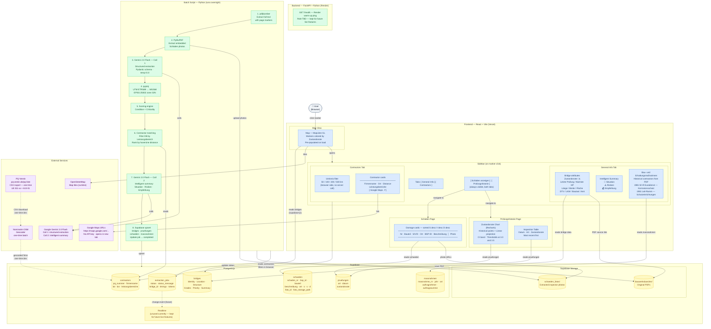

```mermaid
flowchart TD

    %% USER
    USER(["👤 User\n(Browser)"])

    %% FRONTEND
    subgraph FRONTEND["Frontend — React + Vite (Vercel)"]

        subgraph MAPVIEW["Map View"]
            MAP["Map — MapLibre GL\nMarkers colored by Zustandsnote\nPre-populated on load"]
        end

        subgraph SIDEBAR["Sidebar (on marker click)"]
            TABS["Tabs: [ General Info ] [ Contractors ]"]

            subgraph GENERAL["General Info Tab"]
                INFO["Bridge attributes\nZustandsnote / Δ\nLetzte Prüfung / Nächste HP\nLänge / Breite / Fläche\nDTV / LKW / Baulast / Amt"]
                SUMMARY["Intelligent Summary\n🔧 Situation\n⚠️ Risiken\n💰 Empfehlung"]
                MASSNAHMEN["Bau- und Erhaltungsmaßnahmen\nHistorical contractors from PDF\n1981 W+R Eurodienst — Korrosionsschutz\n1981 Leit-Ramm — Schutzeinrichtungen"]
            end

            subgraph CONTRACTORS["Contractors Tab"]
                UMKREIS["Umkreis filter\n50 / 100 / 200 / 500 km\n(browser-side, no server call)"]
                CLIST["Contractor cards\n────────────────────────\nFirmenname · Ort · Distance\nLeistungsbereiche\n[ Google Maps ↗ ]"]
            end

            NAVBUTTONS["[ Schäden anzeigen ]  [ Prüfungshistorie ]\n(always visible, both tabs)"]
        end

        subgraph SCHAEDEN["Schäden Page"]
            CARDS["Damage cards — sorted S desc V desc D desc\n────────────────────────────────────────\nNr · Bauteil · S/V/D · Ort · BSP-ID · Beschreibung  │  Photo\n────────────────────────────────────────"]
        end

        subgraph HISTORY["Prüfungshistorie Page"]
            CHART["Zustandsnote Chart (Recharts)\nHistorical points + Linear projection\nCI band · Thresholds at 3.0 and 3.5"]
            PTABLE["Inspection Table\nDatum · Art · Zustandsnote\nMost recent first"]
        end

    end

    %% BACKEND
    subgraph BACKEND["Backend — FastAPI + Python (Render)"]
        ENDPOINT["GET /health — Render warm-up ping\nRole TBD — kept for future live features"]
    end

    %% BATCH SCRIPT (offline, not a running server)
    subgraph BATCH["Batch Script — Python (runs overnight)"]
        direction TB
        P1["1. pdfplumber\nExtract full text\nwith page markers"]
        P2["2. PyMuPDF\nExtract embedded\nSchäden photos"]
        P3["3. Gemini 2.0 Flash — Call 1\nStructured extraction\nPydantic schema · temp=0.0"]
        P4["4. pyproj\nUTM ETRS89 → WGS84\nEPSG:25832 zone 32N"]
        P5["5. Scoring engine\nCondition × Criticality"]
        P6["6. Contractor matching\nFilter DB by Leistungsbereich\nRank by haversine distance"]
        P7["7. Gemini 2.0 Flash — Call 2\nIntelligent summary\nSituation · Risiken · Empfehlung"]
        P8["8. Supabase upsert\nbridges · pruefungen\nschaeden · massnahmen\nUpdate job → completed"]

        P1 --> P2 --> P3 --> P4 --> P5 --> P6 --> P7 --> P8
    end

    %% SUPABASE
    subgraph SUPABASE["Supabase"]

        subgraph DB["PostgreSQL"]
            T_BRIDGES[("bridges\nIdentity · Location · Structure\nGrades · Priority · Summary")]
            T_PRUEF[("pruefungen\nart · datum\nzustandsnote")]
            T_SCHAD[("schaeden\nschaden_nr · bsp_id · bauteil\nbeschreibung · ort · s · v · d\nfoto_id · foto_storage_path")]
            T_MASS[("massnahmen\nmassnahme_nr · jahr · art\nauftragnehmer · auftragssumme")]
            T_JOBS[("extraction_jobs\nstatus · status_message\nbridge_id · timings · tokens")]
            T_CONT[("contractors\npq_nummer · firmenname\nlat · lon · leistungsbereiche")]
        end

        subgraph STORAGE["Supabase Storage"]
            S_PDF[("bauwerksbuecher/\nOriginal PDFs")]
            S_FOTO[("schaeden_fotos/\nExtracted inspector photos")]
        end

        REALTIME["Realtime\n(unused currently — kept for future live features)"]
    end

    %% EXTERNAL
    subgraph EXTERNAL["External Services"]
        GEMINI["Google Gemini 2.0 Flash\nCall 1: structured extraction\nCall 2: intelligent summary"]
        NOMINATIM["Nominatim OSM\nGeocoder\none-time batch"]
        PQVEREIN["PQ-Verein\npq-verein.de/pq-liste\nCSV export — one time\nLB 311-xx + 613-01"]
        OSM["OpenStreetMap\nMap tiles (runtime)"]
        GMAPS["Google Maps URLs\nhttps://maps.google.com/...\nNo API key · opens in new tab"]
    end

    %% USER INTERACTIONS
    USER -- "click marker" --> MAP
    MAP -- "opens" --> SIDEBAR
    NAVBUTTONS -- "navigate to" --> SCHAEDEN
    NAVBUTTONS -- "navigate to" --> HISTORY
    CLIST -- "link" --> GMAPS

    %% FRONTEND ← SUPABASE READS
    MAP -- "reads bridges\n(supabase-js)" --> T_BRIDGES
    INFO -- "reads bridge data" --> T_BRIDGES
    MASSNAHMEN -- "reads massnahmen" --> T_MASS
    CARDS -- "reads schaeden" --> T_SCHAD
    CHART -- "reads pruefungen" --> T_PRUEF
    PTABLE -- "reads pruefungen" --> T_PRUEF
    CONTRACTORS -- "reads contractors\nfilters in browser" --> T_CONT

    %% FRONTEND ← STORAGE
    CARDS -- "photo URLs" --> S_FOTO
    INFO -- "PDF source link" --> S_PDF

    %% REALTIME (unused currently)
    T_JOBS -. "change event (future)" .-> REALTIME

    %% BATCH SCRIPT → SUPABASE
    P2 -- "upload photos" --> S_FOTO
    P3 -- "calls" --> GEMINI
    P7 -- "calls" --> GEMINI
    BATCH -- "save PDF" --> S_PDF
    P8 -- "upsert" --> DB
    BATCH -- "update status" --> T_JOBS
    P6 -- "reads" --> T_CONT

    %% MAP TILES
    MAP -- "tiles" --> OSM

    %% ONE-TIME SEEDING
    PQVEREIN -. "CSV download\none-time dev" .-> NOMINATIM
    NOMINATIM -. "geocoded firms\none-time dev" .-> T_CONT

    %% STYLES
    classDef frontend fill:#dbeafe,stroke:#3b82f6,color:#1e3a5f
    classDef backend fill:#dcfce7,stroke:#22c55e,color:#14532d
    classDef supabase fill:#fef9c3,stroke:#eab308,color:#713f12
    classDef external fill:#f3e8ff,stroke:#a855f7,color:#4a044e
    classDef user fill:#f1f5f9,stroke:#64748b,color:#0f172a

    class MAP,TABS,INFO,SUMMARY,MASSNAHMEN,UMKREIS,CLIST,NAVBUTTONS,CARDS,CHART,PTABLE frontend
    class ENDPOINT backend
    class P1,P2,P3,P4,P5,P6,P7,P8 backend
    class T_BRIDGES,T_PRUEF,T_SCHAD,T_MASS,T_JOBS,T_CONT,S_PDF,S_FOTO,REALTIME supabase
    class GEMINI,NOMINATIM,PQVEREIN,OSM,GMAPS external
    class USER user
```
