# BrückenPilot — System Architecture

```mermaid
flowchart TD

    %% USER
    USER(["👤 User\n(Browser)"])

    %% FRONTEND
    subgraph FRONTEND["Frontend — React 19 + Vite (Vercel) · reads Supabase directly"]

        SHELL["Shell\nSidebar (Karte · Alle Brücken · Dringlichkeit filter)\nTopbar search → live bridge dropdown\nLight / Dark theme"]

        subgraph MAPVIEW["Map View"]
            MAP["MapLibre GL\nMarkers colored by Zustandsnote · states tinted by worst urgency\nContractor pin + viewport fit (Auf Karte zeigen)"]
        end

        subgraph PANEL["Detail Panel (on marker / search select)"]
            TABS["Tabs: [ Allgemein ] [ Schäden ] [ Firmen ]"]

            subgraph GENERAL["Allgemein"]
                ZUSTAND["Zustand\nZustandsnote + worst S/V/D\nclick S/V/D → 7.5 Begründung popover"]
                PRIO["Priorität\ncondition × criticality\nDTV · Straßenklasse · geschätzte Kosten"]
                CHART["Verlauf der Prüfungen (Recharts)\nhistorical Zustandsnote — no projection"]
                STAMM["Stammdaten"]
                SUMMARY["KI-Einschätzung\nSituation · Risiken · Empfehlung"]
            end

            subgraph SCHAEDEN["Schäden"]
                CARDS["Damage cards — sorted S/V/D desc\nNr · Bauteil · Beschreibung · S/V/D · BSP-ID · Photo (lightbox)\n🔧 Maßnahmenempfehlung → linked 7.6 popover"]
            end

            subgraph CONTRACTORS["Firmen"]
                UMKREIS["Umkreis slider (browser-side haversine)\ncapability tags"]
                CLIST["Contractor cards · Distance\n[ Auf Karte zeigen ⌖ ]  [ Google Maps ↗ ]"]
            end

            PDFBTN["[ Bauwerksbuch PDF öffnen ] → inline viewer"]
        end
    end

    %% BATCH PIPELINE (offline, not a running server)
    subgraph BATCH["Batch Pipeline — Python (offline, run_overnight.py · idempotent by SHA-256)"]
        direction TB
        P1["1. pdfplumber text + page markers\nscan? (≤50 chars/page) → Tesseract OCR (deu)"]
        P2["2. Photo extraction (section 7.4)\ndigital: embedded objects\nscan: filtered embeds + stitched tiles → DocLayout-YOLO crop"]
        P3["3. LLM extraction — Call 1\nLlama 4 Maverick (DO) primary / Gemini fallback\nPydantic schema + domain gates · temp=0.0\ndeterministic [n] count → self-correcting retry"]
        P3B["3b. Deterministic linking (no LLM)\nphoto↔damage by Bild: caption\n7.6 Empfehlung {n} ↔ Zugeordnete Schäden [n]"]
        P4["4. pyproj UTM (ETRS89) → WGS84\nno coords → Nominatim geocode (flagged)"]
        P5["5. Scoring\ncondition × (0.5 + 0.5·criticality)"]
        P6["6. Contractor capability set\nfrom construction type"]
        P7["7. LLM summary — Call 2\nSituation · Risiken · Empfehlung"]
        P8["8. Supabase upsert\nbridges · pruefungen · schaeden · empfehlungen\nupload PDF + photos · job → completed"]

        P1 --> P2 --> P3 --> P3B --> P4 --> P5 --> P6 --> P7 --> P8
    end

    %% SUPABASE
    subgraph SUPABASE["Supabase"]

        subgraph DB["PostgreSQL"]
            T_BRIDGES[("bridges\nidentity · location · structure · traffic\ngrades · max_s/v/d (+ Begründung)\npriority · geschätzte Kosten · summary")]
            T_PRUEF[("pruefungen\nart · datum · zustandsnote")]
            T_SCHAD[("schaeden\nschaden_nr · bsp_id · bauteil\nbeschreibung · ort · s · v · d\nfoto_storage_path")]
            T_EMPF[("empfehlungen (7.6)\nnr · art_der_leistung · dringlichkeit\ngeschätzte Kosten · ausführungsjahr\nzugeordnete_schaeden int[]")]
            T_JOBS[("extraction_jobs\nstatus · timings · tokens · sha256")]
            T_CONT[("contractors\npq_nummer · firmenname\nlat · lon · leistungsbereiche")]
        end

        subgraph STORAGE["Supabase Storage"]
            S_PDF[("bauwerksbuecher/\nOriginal PDFs (public read)")]
            S_FOTO[("schaeden_fotos/\nExtracted inspector photos")]
        end
    end

    %% EXTERNAL
    subgraph EXTERNAL["External Services"]
        LLM["LLM providers\nLlama 4 Maverick — DigitalOcean Gradient (primary)\nGemini (fallback)"]
        NOMINATIM["Nominatim OSM\nGeocoder (bridges + contractors)"]
        PQVEREIN["PQ-Verein\nCSV export — one time\nLB 311-xx + 613-01"]
        OSM["OpenStreetMap\nMap tiles (runtime)"]
        GMAPS["Google Maps URLs\nopens contractor location · no API key"]
    end

    %% USER INTERACTIONS
    USER -- "click marker / search" --> MAP
    MAP -- "opens" --> PANEL
    CLIST -- "deep-link" --> GMAPS
    CLIST -- "drops pin" --> MAP

    %% FRONTEND ← SUPABASE READS
    MAP -- "reads bridges" --> T_BRIDGES
    GENERAL -- "reads bridge data" --> T_BRIDGES
    CHART -- "reads pruefungen" --> T_PRUEF
    CARDS -- "reads schaeden" --> T_SCHAD
    CARDS -- "reads empfehlungen" --> T_EMPF
    CONTRACTORS -- "reads contractors (filter in browser)" --> T_CONT
    CARDS -- "photo URLs" --> S_FOTO
    PDFBTN -- "signed PDF URL" --> S_PDF

    %% BATCH PIPELINE → SUPABASE / EXTERNAL
    P2 -- "upload photos" --> S_FOTO
    P3 -- "calls" --> LLM
    P7 -- "calls" --> LLM
    P4 -- "geocode fallback" --> NOMINATIM
    P8 -- "save PDF" --> S_PDF
    P8 -- "upsert" --> DB
    P6 -- "reads" --> T_CONT

    %% MAP TILES
    MAP -- "tiles" --> OSM

    %% ONE-TIME SEEDING
    PQVEREIN -. "CSV (one-time)" .-> NOMINATIM
    NOMINATIM -. "geocoded firms (one-time)" .-> T_CONT

    %% STYLES
    classDef frontend fill:#dbeafe,stroke:#3b82f6,color:#1e3a5f
    classDef batch fill:#dcfce7,stroke:#22c55e,color:#14532d
    classDef supabase fill:#fef9c3,stroke:#eab308,color:#713f12
    classDef external fill:#f3e8ff,stroke:#a855f7,color:#4a044e
    classDef user fill:#f1f5f9,stroke:#64748b,color:#0f172a

    class SHELL,MAP,TABS,ZUSTAND,PRIO,CHART,STAMM,SUMMARY,CARDS,UMKREIS,CLIST,PDFBTN frontend
    class P1,P2,P3,P3B,P4,P5,P6,P7,P8 batch
    class T_BRIDGES,T_PRUEF,T_SCHAD,T_EMPF,T_JOBS,T_CONT,S_PDF,S_FOTO supabase
    class LLM,NOMINATIM,PQVEREIN,OSM,GMAPS external
    class USER user
```

## Notes

- **No live API server.** The frontend reads Supabase directly (Row-Level Security + the public anon key); the pipeline is an **offline batch** (`run_overnight.py`), not a deployed service.
- **Deterministic over LLM** wherever structure allows: the `[n]` damage count (with self-correcting retry), photo↔damage caption matching, and the 7.6 `Maßnahmenempfehlung {n}` ↔ `Zugeordnete Schäden` link are all parsed from the document's own markers — the LLM is corrected against them, never trusted blindly.
- **Idempotent & auditable:** SHA-256 skip keys, upsert-on-natural-key, deterministic storage paths, and `source_pages` linking every headline value back to its PDF page.
